## 1) Описание первого бага

**Заголовок:** Стартовое меню. При старте бот не запрашивает ФИО официанта 

**Предусловия:** Бот не запущен, активна кнопка начать

**Шаги:**
1. Нажать кнопку «Начать».
2. Происходит отправка сообщения /start

**Фактический результат:** Бот предлагает начать смену

**Ожидаемый результат:** Перед началом смены бот должен спросить фио официанта

**Окружение:** Telegram Desktop 4.14.13 x64 **Скриншот:** 

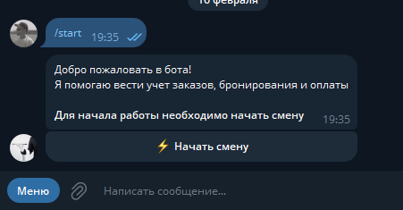

**Окружение:** Telegram iOS 17.1.1 iPhone 13  **Скриншот:**

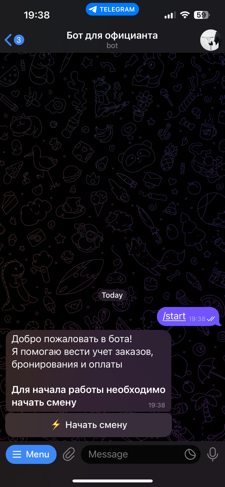

## 2) Описание второго бага
**Заголовок:** Список блюд. При нажатии в начало на 1 странице выдает "Bad request"

**Предусловия:** Бот запущен, открыто главное меню

**Шаги:**
1. Нажать кнопку «Список блюд».
2. Нажать кнопку "В начало"
3. Происходит отправка сообщения "🔥🔥🔥 Bad Request: message is not modified: specified new message content and reply markup are exactly the same as a current content and reply markup of the message"

**Окружение:** Telegram Desktop 4.14.13 x64 **Скриншот:** 

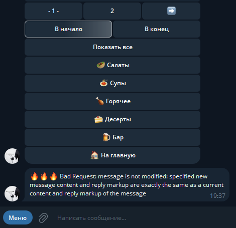

**Окружение:** Telegram iOS 17.1.1 iPhone 13  **Скриншот:**

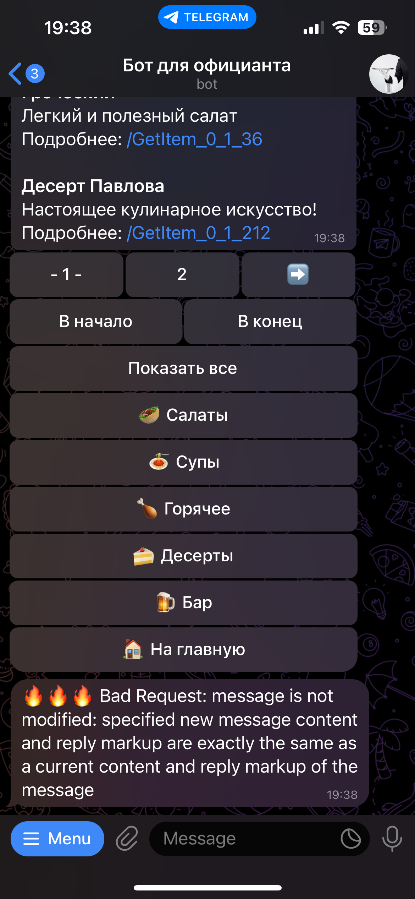

## 3) Описание третьего бага
**Заголовок:** Список блюд. При нажатии в конец на 5 странице выдает "Bad request"

**Предусловия:** Бот запущен, открыто главное меню

**Шаги:**
1. Нажать кнопку «Список блюд».
2. Нажать кнопку "В конец"
3. Происходит перемещение на 5 страницу меню
4. Нажать кнопку "В конец"
5. Происходит отправка сообщения "🔥🔥🔥 Bad Request: message is not modified: specified new message content and reply markup are exactly the same as a current content and reply markup of the message"

**Окружение:** Telegram Desktop 4.14.13 x64 **Скриншот:** 

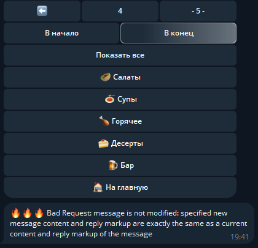

**Окружение:** Telegram iOS 17.1.1 iPhone 13  **Скриншот:** 

## 4) Описание четвертого бага

**Заголовок:** Кнопки списка блюд. Ошибка в отображении стрелок и цифр на первой и пятой страницах

**Предусловия:** Бот запущен, открыто главное меню

**Шаги:**
1. Нажать кнопку «Список блюд».

**Фактический результат:** Расположение стрелок и цифр на 1 и 5 страницах отличается от 2, 3 и 4 страниц меню.

**Окружение:** Telegram Desktop 4.14.13 x64 **Скриншот:** 

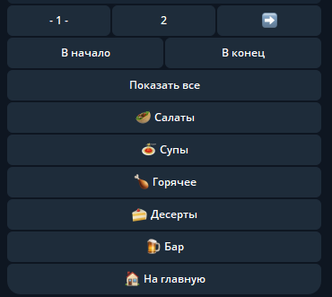 

**Окружение:** Telegram iOS 17.1.1 iPhone 13  **Скриншот:** 

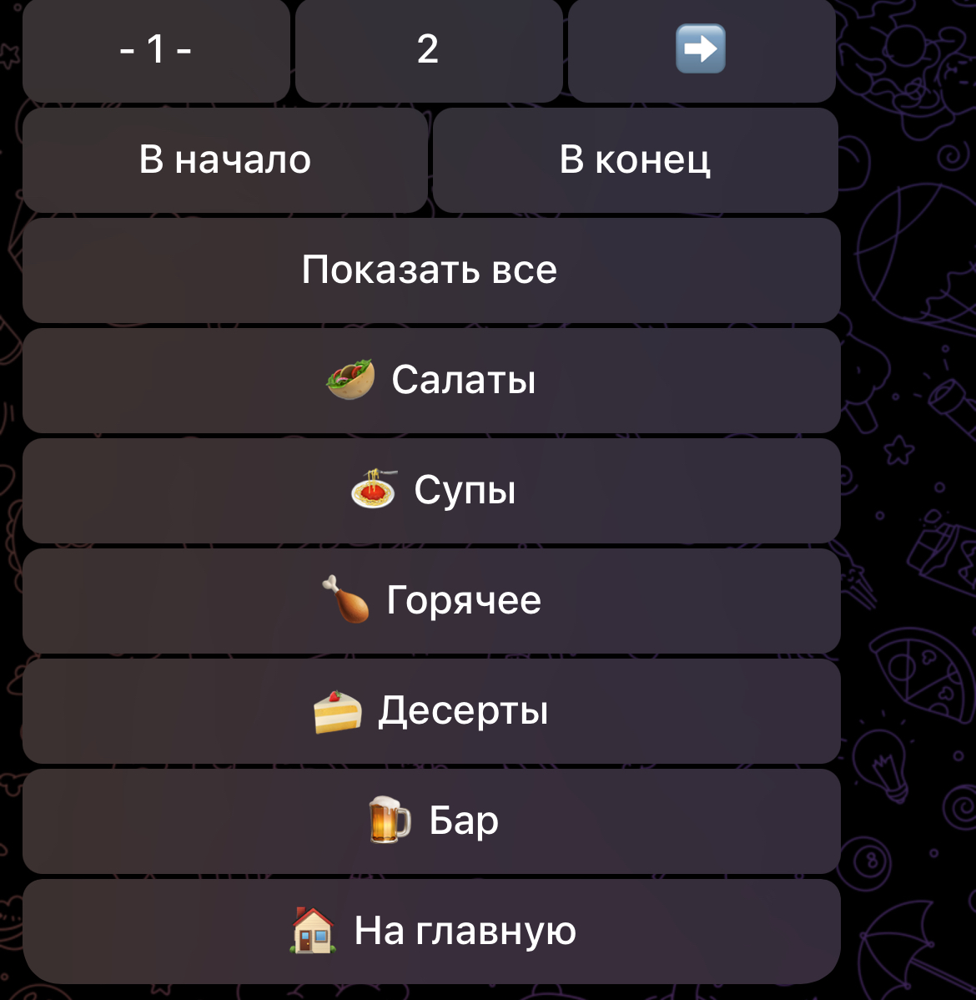 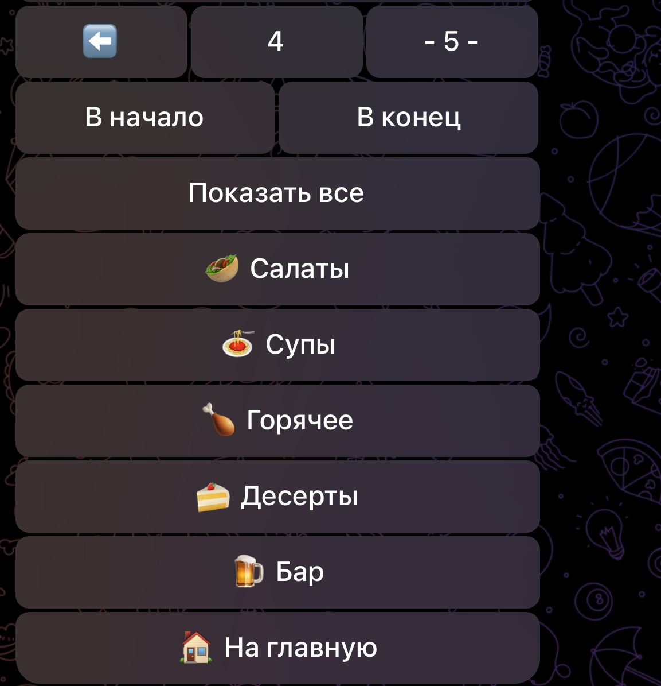

**Ожидаемый результат:** Расположение стрелок и цифр на каждой странице унифицировано

**Окружение:** Telegram Desktop 4.14.13 x64 **Скриншот:** 

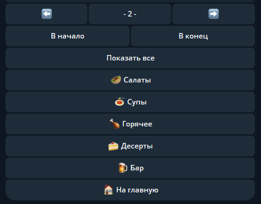

**Окружение:** Telegram iOS 17.1.1 iPhone 13  **Скриншот:**

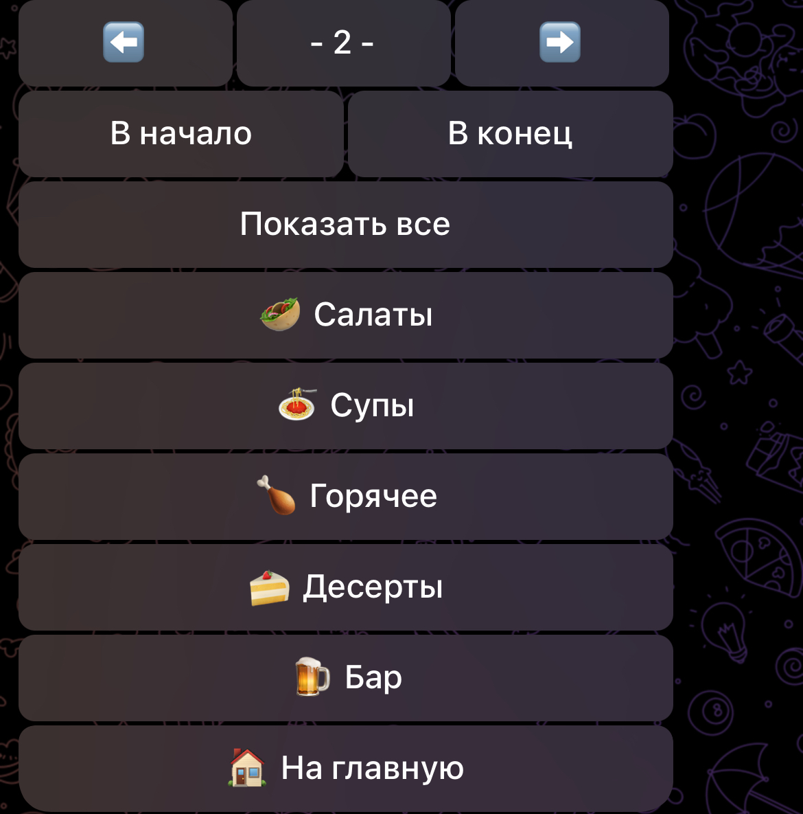

## 5) Описание пятого бага

**Заголовок:** Кнопки списка блюд. Переход на следующую страницу при помощи двух кнопок

**Предусловия:** Бот запущен, открыт список блюд на первой странице

**Шаги:**
1. Нажать на 2

**Фактический результат:** Переход на следующую страницу меню

**Ожидаемый результат:** Кнопка 2 не должна находить на данной странице

**Окружение:** Telegram Desktop 4.14.13 x64 **Скриншот:** 

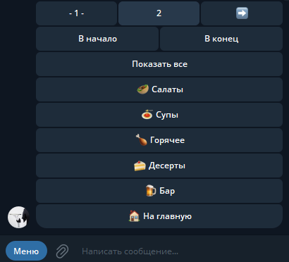

**Окружение:** Telegram iOS 17.1.1 iPhone 13  **Скриншот:*

* 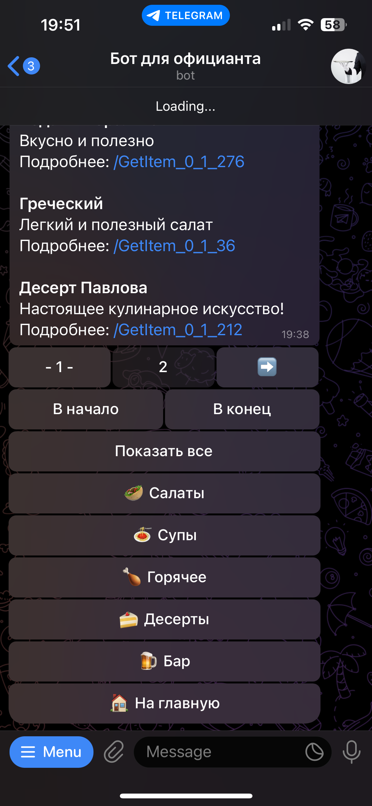

## 6) Описание Шестого бага

**Заголовок:** Кнопки списка блюд. Переход на предыдущую страницу при помощи двух кнопок

**Предусловия:** Бот запущен, открыт список блюд на последней странице

1. Нажать на 4

**Фактический результат:** Переход на предыдущую страницу меню

**Ожидаемый результат:** Кнопка 4 не должна находить на данной странице

**Окружение:** Telegram Desktop 4.14.13 x64 **Скриншот:** 

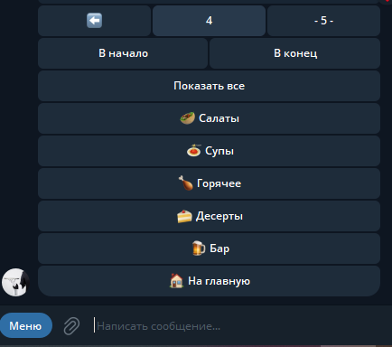

**Окружение:** Telegram iOS 17.1.1 iPhone 13  **Скриншот:** 

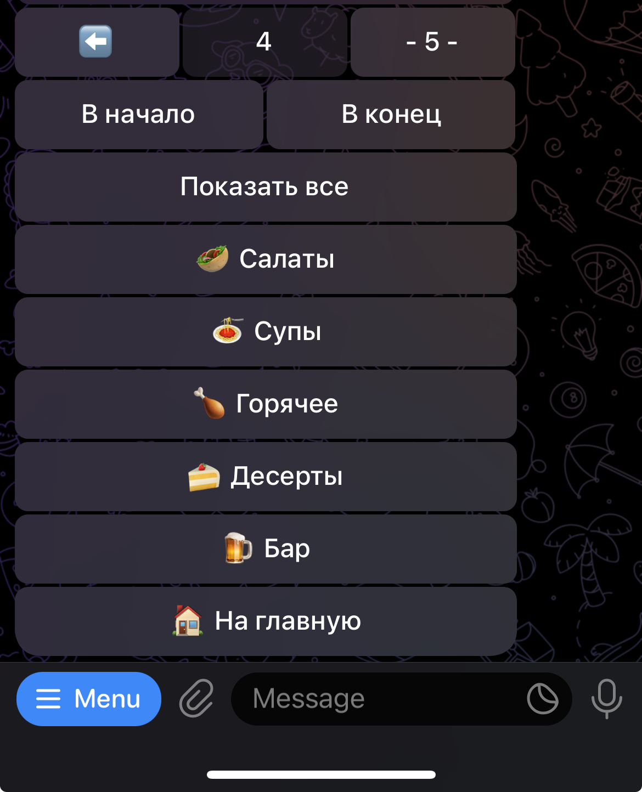

## 7) Описание седьмого бага

**Заголовок:** Описание блюд. Отсутствует описание салата Мимоза

**Предусловия:** Бот запущен, открыт список блюд на третьей странице

**Шаги:**
1. Нажать на подробнее `/GetItem_0_3_28`

**Фактический результат:** Бот выдает ошибку "🔥🔥🔥 Bad Request: can't parse entities: Character '(' is reserved and must be escaped with the preceding '\'"

**Окружение:** Telegram Desktop 4.14.13 x64 **Скриншот:** 

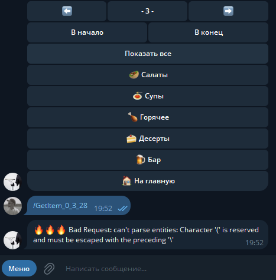

**Окружение:** Telegram iOS 17.1.1 iPhone 13  **Скриншот:**

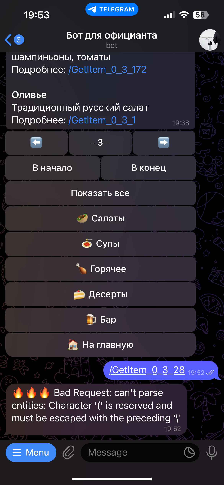

**Ожидаемый результат:** Бот выдает описание салата Мимоза
## 8) Описание восьмого бага

**Заголовок:** Описание блюд. Отсутствует описание супа Солянка

**Предусловия:** Бот запущен, открыт список блюд на четвертой странице

**Шаги:**
1. Нажать на подробнее `/GetItem_0_4_68`

**Фактический результат:** Бот выдает ошибку "🔥🔥🔥 Bad Request: can't parse entities: Character '(' is reserved and must be escaped with the preceding '\'"

**Окружение:** Telegram Desktop 4.14.13 x64 **Скриншот:** 

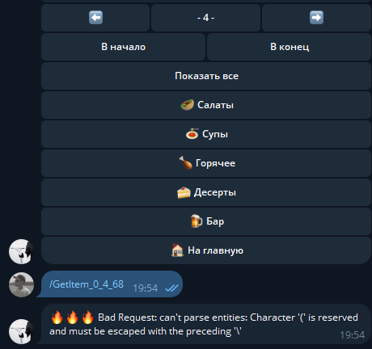

**Окружение:** Telegram iOS 17.1.1 iPhone 13  **Скриншот:**

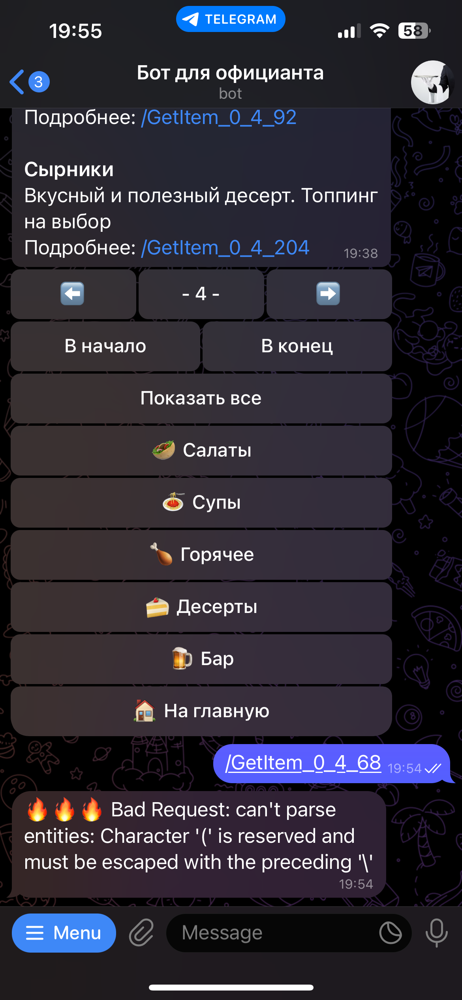

**Ожидаемый результат:** Бот выдает описание супа Солянка
## 9) Описание Девятого бага

**Заголовок:** Занятые столы. Отсутствует кнопка последнего занятого стола при нечетном количестве занятых столов

**Предусловия:** Бот запущен, занято четное количество столов

**Шаги:**
1. Нажать кнопку все столы
2. Нажать на любой свободный стол
3. Нажать кнопку занять стол
4. Нажать кнопу на главную
5. Нажать на кнопку Список занятых столов

**Фактический результат:** Не отображается инлайн кнопка для последнего занятого стола

**Окружение:** Telegram Desktop 4.14.13 x64 **Скриншот:** 

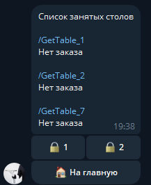

**Окружение:** Telegram iOS 17.1.1 iPhone 13  **Скриншот:**

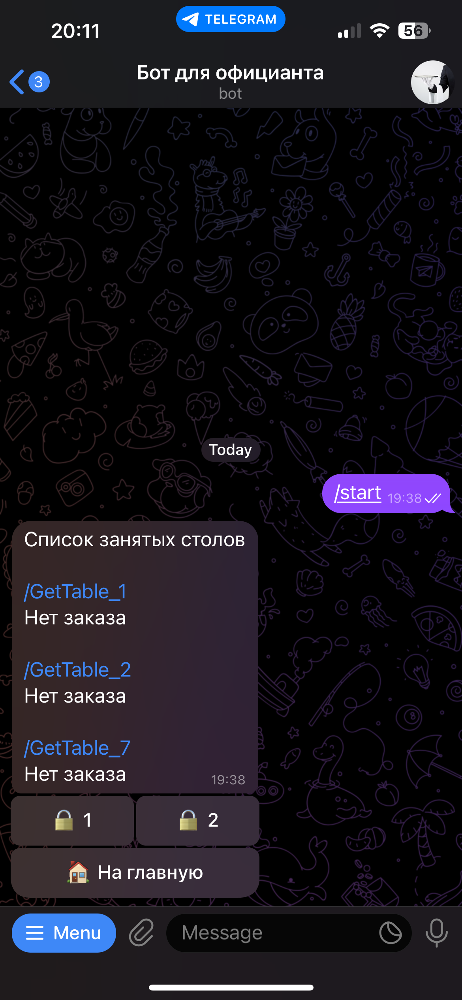

**Ожидаемый результат:** Бот выдает кнопки инлайн кнопки для каждого занятого стола

## 10) Описание десятого бага

**Заголовок:** Заказ блюда. Отсутствует возможность заказать блюдо в граммах

**Предусловия:** Бот запущен, открыт стол 1

**Шаги:**
1. Нажать кнопку добавить в заказ
2. Выбрать десерты
3. Выбрать наполеон
4. Ввести 500 грамм

**Фактический результат:** Некорректное количество. Повтори ввод. Принимается только число и заносится штук.

**Ожидаемый результат:** Добавление 500 грамм блюда Наполеон(см. требование пункт 2 раздела 3 "Список блюд")

**Окружение:** Telegram Desktop 4.14.13 x64 **Скриншот:** 

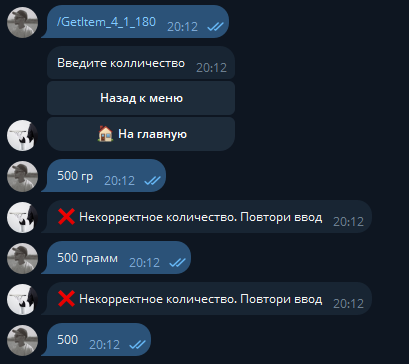

**Окружение:** Telegram iOS 17.1.1 iPhone 13  **Скриншот:** 

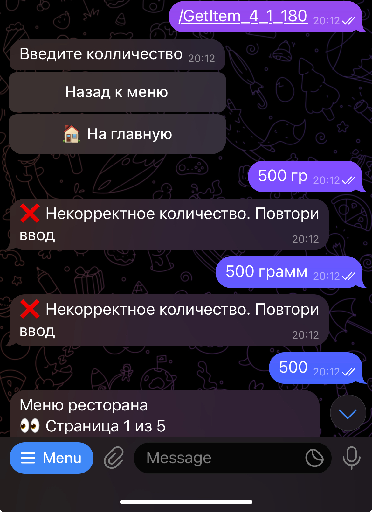

## 11) Описание одиннадцатого бага

**Заголовок:** Заказ блюда. Отсутствует ограничение в количестве на заказ

**Предусловия:** Бот запущен, открыт стол 1

**Шаги:**
1. Нажать кнопку добавить в заказ
2. Выбрать минеральную воду
3. Ввести число 2 147 483 647

**Фактический результат:** Бот принял данный заказ, хотя наврятли такое количество минералки найдется на складе

**Ожидаемый результат:** Бот не должен принять заказ, превышающий остаток на балансе ресторана, выдать ошибку "❌ Некорректное количество. Повтори ввод"

**Окружение:** Telegram Desktop 4.14.13 x64 **Скриншот:** 

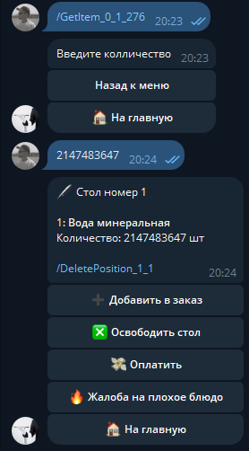

**Окружение:** Telegram iOS 17.1.1 iPhone 13  **Скриншот:** 

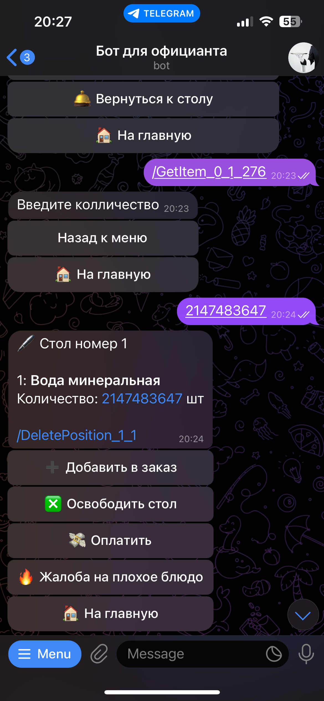

## 12) Описание двенадцатого бага
**Заголовок:** Удаление позиции. Отсутствуют возможность удалить всю позицию целиком

Предусловие: Бот запущен, открыт стол номер 1, блюдо заказано в количестве больше, чем 1

**Шаги:**
1. Нажать кнопку `/DeletePosition_1_1`
2. Бот прислал сообщение об удалении
3. Нажать на кнопку "На главную"
4. Нажать на кнопку Все столы
5. Нажать на кнопку первого стола

**Фактический результат:** Удалилась одна порция позиции

**Ожидаемый результат:** Удалилась вся позиция

**Окружение:** Telegram Desktop 4.14.13 x64 **Скриншот:** 

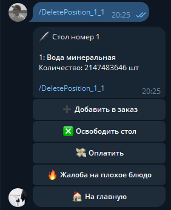

**Окружение:** Telegram iOS 17.1.1 iPhone 13  **Скриншот:** 

## 13) Описание Тринадцатого бага

**Заголовок:** Заказ блюда. Отсутствует ограничение на ввод отрицательных чисел

**Предусловия:** Бот запущен, открыт стол 1

1. Нажать кнопку добавить в заказ
2. Выбрать минеральную воду
3. Ввести число -1

**Фактический результат:** Бот принял данный заказ, теперь клиент принесет нам минеральную воду?

**Ожидаемый результат:** Бот не должен принять заказ, выдать ошибку "❌ Некорректное количество. Повтори ввод"

**Окружение:** Telegram Desktop 4.14.13 x64 **Скриншот:** 

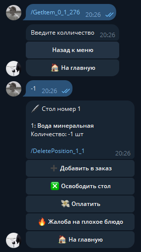

**Окружение:** Telegram iOS 17.1.1 iPhone 13  **Скриншот:**

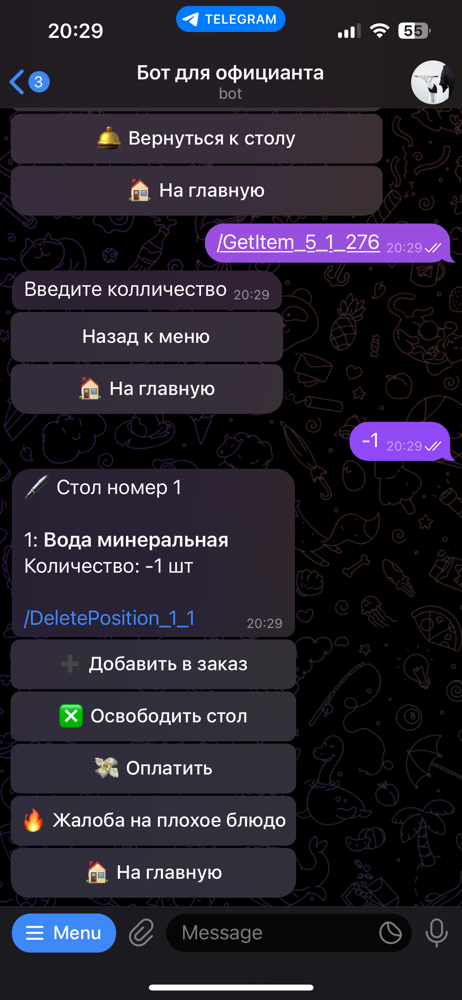

## 14) Описание четырнадцатого бага 

**Заголовок:** Жалоба на плохое блюдо. Сообщение бота не отображает эмодзи

**Предусловия:** Бот запущен, открыт стол 1

1. Нажать кнопку Жалоба на плохое блюдо

**Фактический результат:** Бот выдал сообщение с кодом эмодзи, вместо эмодци

**Ожидаемый результат:** Бот выдал сообщение содержащий эмодзи 📸

**Окружение:** Telegram Desktop 4.14.13 x64 **Скриншот:** 

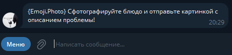

**Окружение:** Telegram iOS 17.1.1 iPhone 13  **Скриншот:** 

## 15) Описание пятнадцатого бага

**Заголовок:** Жалоба на плохое блюдо. Бот принимает картинку без описания

**Предусловия:** Бот запущен, открыт стол 1

**Шаги:**
1. Нажать кнопку Жалоба на плохое блюдо
2. Сделать фото 
3. Отправить фото без описания

**Фактический результат:** Бот принял фото

**Ожидаемый результат:** Бот попросил приложить описание к фото

**Окружение:** Telegram Desktop 4.14.13 x64 **Скриншот:** 

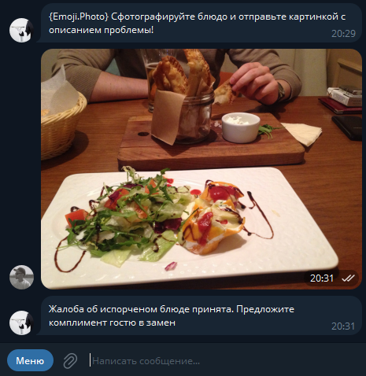

**Окружение:** Telegram iOS 17.1.1 iPhone 13  **Скриншот:** 

### 15) *Не баг, а скорее неудобство для пользователя, после отправки фото бот не предлагает действий, приходится дополнительно нажать кнопку меню и выбрать команду

## 16) Описание Шестнадцатого бага

**Заголовок:** Занятые столы. Отсутствует сортировка столов по возрастанию

**Предусловия:** Бот запущен, заняты столы с 1-9, последними заняты 7 и 1 стол соответственно

1. Нажать кнопку Занятые столы

**Фактический результат:** Столы отсортированы в порядке занимания столов

**Ожидаемый результат:** Столы отсортированы в порядке возрастания номеров(см. пункт требований 2 раздела 5)

**Окружение:** Telegram Desktop 4.14.13 x64 **Скриншот:** 

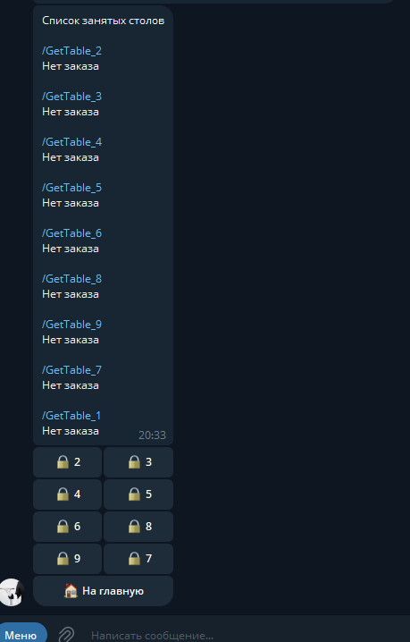

**Окружение:** Telegram iOS 17.1.1 iPhone 13  **Скриншот:** 

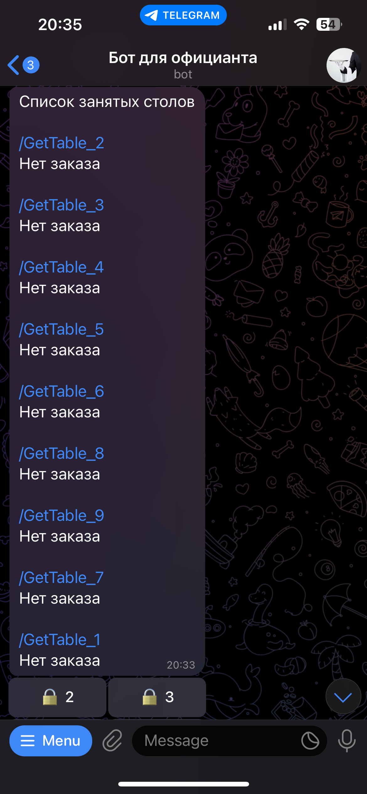

## 17) Описание Семнадцатого бага

**Заголовок:** Заказ блюда. Невозможно заказать блюдо с отсутствующим описанием

Предусловие: Бот запущен. Открыт стол 2.

**Шаги:**
1. Нажать на кнопку Добавить заказ
2. Нажать на кнопку Салаты
3. Нажать на кнопку `/GetItem_1_1_28`

**Фактический результат:** Бот выдал ошибку "🔥🔥🔥 Bad Request: can't parse entities: Character '(' is reserved and must be escaped with the preceding"

**Ожидаемый результат:** Открытие формы ввести количество, добавление блюда в заказ

**Окружение:** Telegram Desktop 4.14.13 x64 **Скриншот:** 

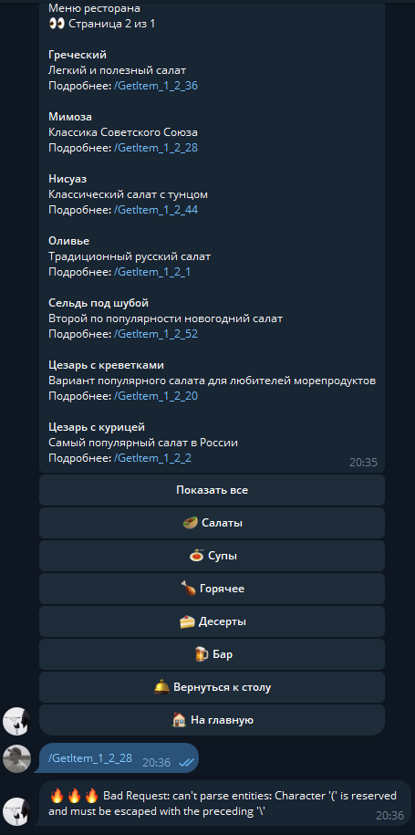

**Окружение:** Telegram iOS 17.1.1 iPhone 13  **Скриншот:** 

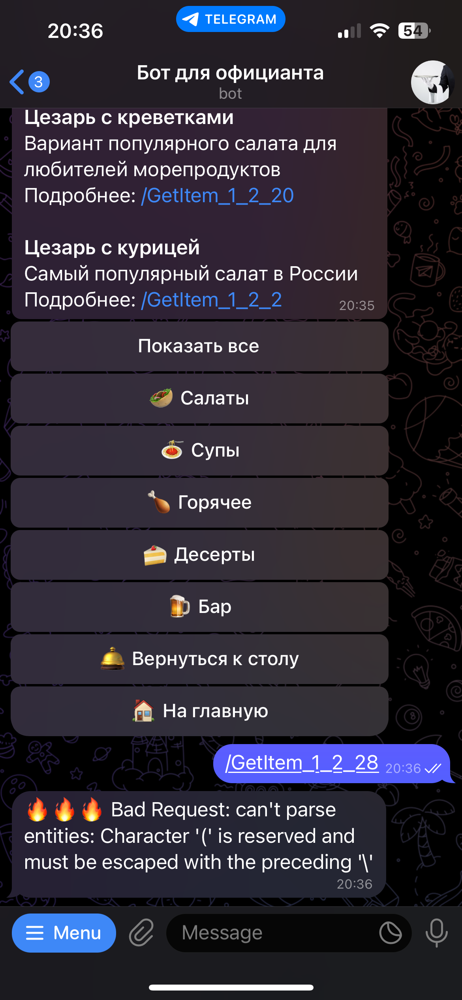

## 18) Описание Восемнадцатого бага

**Заголовок:** Заказ блюда. Опечатка в слове количество

Предусловие: Бот запущен. Открыто форма заказа блюда

1. Нажать на любое блюдо

**Фактический результат:** Введите коЛличество

**Ожидаемый результат:** Введите количество

**Окружение:** Telegram Desktop 4.14.13 x64 **Скриншот:** 

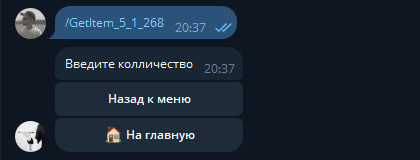

**Окружение:** Telegram iOS 17.1.1 iPhone 13  **Скриншот:** 

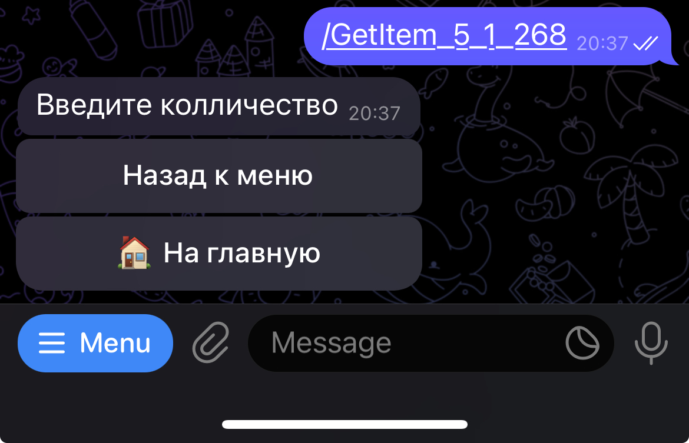

